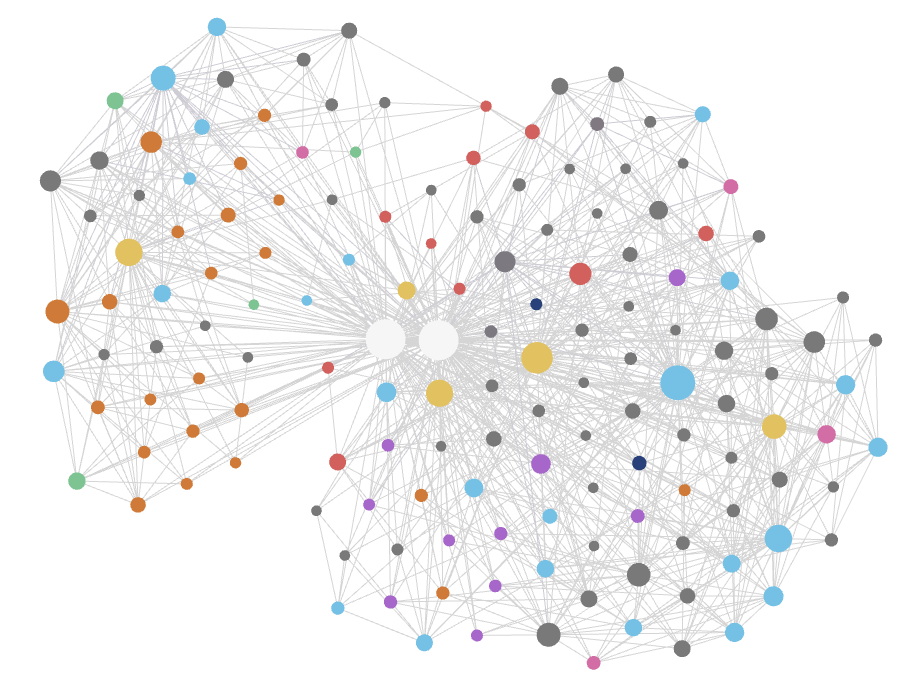

# obsidian-llm-wiki

**Your second brain for Obsidian, built and maintained by an AI agent.**

Simply drop in your sources (PDFs, slides, links, blogs, and almost any other file format). The agent processes each one into linked Markdown, files it correctly, and keeps your cross-references and catalogue completely up to date. Instead of building a folder of unread clippings, you create a structured, compounding knowledge base that an AI can read natively.

Once populated, the wiki can:
* **Answers and generation:** The agent answers questions and creates almost any deliverable, from briefs and reports to presentations, tables, and cross-source syntheses.
* **Smart referencing:** It acts as a living, cited knowledge base that any agent can draw from. This grounds every answer in your own sources while maintaining highly efficient token usage.
* **Self-maintenance and growth:** The system actively cross-links files, merges duplicates, and flags conflicting information or knowledge gaps. It automatically maintains your catalogue and graph as your information compounds.

We purposely designed the architecture to be universal and highly adaptable. Although it is pre-tuned for AI and machine learning research (treating models and benchmarks as primary note types), you can easily customise the repository to perfectly fit your own field or workflow.



## Setup

This is a framework rather than a plugin: it runs on an AI coding agent that reads `CLAUDE.md` and the skills in `.claude/skills/`. Setup takes about ten minutes.

1. **Obsidian and the agent.** Install [Obsidian](https://obsidian.md) and open this folder as a vault. Then install the agent: the **Claudian** community plugin (Settings → Community plugins → Browse → *Claudian*), or [Claude Code](https://claude.com/claude-code) run from a terminal in the vault. Claudian is the only Obsidian plugin the framework requires.

2. **Command-line tools.** Install MarkItDown, which converts PDFs and Office documents to Markdown:

   ```bash
   pip install 'markitdown[all]'
   ```

   `python3`, `curl`, and `git` are also used, and are usually already present.

3. **Capture skills (recommended).** Install kepano's [obsidian-skills](https://github.com/kepano/obsidian-skills) — the agent uses `defuddle` for clean web capture and `obsidian-cli` for vault access. Without them, the framework falls back to `curl` and MarkItDown.

4. **Web Clipper (optional).** The [Obsidian Web Clipper](https://obsidian.md/clipper) browser extension saves web pages into `raw/` in one click. You can also drop files in `raw/` or paste a URL to the agent.

5. **Clone and try the demo.**

   ```bash
   git clone https://github.com/HurricaHjz/obsidian-llm-wiki.git
   cd obsidian-llm-wiki
   bash setup.sh --with-example
   ```

   Open the folder in Obsidian, open the graph view, and ask the agent `/query what is GPT?`. The answer is drawn from the bundled demo, with links to the notes behind it. Run `bash setup.sh --reset` when you are ready to start your own knowledge base.

   Once you have explored the demo, the `examples/` folder is safe to delete — it is only the sample wiki and is never needed again.

6. **Back up your vault (optional).** Install the [Obsidian Git](https://github.com/Vinzent03/obsidian-git) plugin to sync your *whole* vault — notes included — to a **private** repository, for version history and multi-device backup. Keep that private remote separate from this public framework repo; your notes are never part of it.

Running an LLM agent consumes API credits.

## Usage

**New here? Read the [Manual](Manual.md).** It covers the commands, the capture → compile → ask → maintain workflow, and all the options in full — so this README doesn't repeat them.

## How it works

Sources live in `raw/`; compiled notes live in `wiki/`, organised by type, with a generated `index.md` and `log.md`. The skills:

| Skill | Purpose |
|-------|---------|
| `ingest` | Compile sources from `raw/` into linked notes. |
| `gather` | Capture a topic (a page and the sources it cites) into `raw/`. |
| `query` | Answer a question from the wiki, with citations. |
| `output` | Produce a grounded, cited document in `output/`. |
| `lint` | Check the wiki for broken links, orphans, and gaps. |
| `export-okf` | Export the wiki as a portable Open Knowledge Format bundle. |
| `export-template` | Publish framework changes to GitHub. Contributors only; see the [Manual](Manual.md) and [CONTRIBUTING](CONTRIBUTING.md). |

## What the repository tracks

The repository holds the framework only — skills, rules, configuration, and a small demo. Your own notes stay on your machine: `wiki/`, `raw/`, `index.md`, `log.md`, and `output/` are excluded by `.gitignore`, so pushing only ever publishes changes to the framework.

To back those notes up, use the optional Obsidian Git step above — a separate, private repository.

## Credits and licence

Based on Andrej Karpathy's [LLM Wiki](https://gist.github.com/karpathy/442a6bf555914893e9891c11519de94f) pattern and kepano's [obsidian-skills](https://github.com/kepano/obsidian-skills). Released under the MIT License ([`LICENSE`](LICENSE.md)); contributions are welcome (see [`CONTRIBUTING.md`](CONTRIBUTING.md)).
